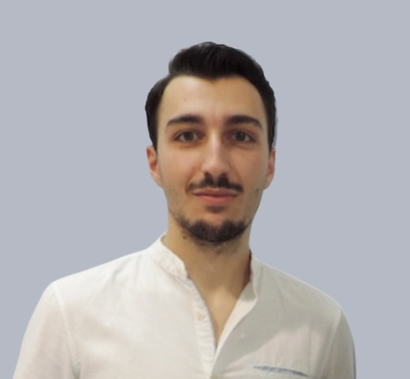

I am a PhD student in Computer Science at JHU,  
working with Professor <a href="https://nicolasloizou.github.io/"> Nicolas Loizou</a> and <a href="http://vision.jhu.edu/rvidal.html"> Renè Vidal</a>.  
 

I am interested in algorithms for machine learning and optimization    
with the higher goal of providing theoretical guarantees for the    
reliable and successful use of machine learning algorithms. 

To achieve this, I enjoy combining my diverse research interests:   
 
machine learning, (multi-agent) optimization, theoretical computer science and game theory.

Prior, I worked with Professor <a href="https://www.softlab.ntua.gr/~fotakis/"> Dimitris Fotakis</a> and Professor <a href="https://euclid.ee.duth.gr/"> Pavlos Efraimidis</a>   
on the intersection of theoretical computer science and opinion dynamics.   
 
I received a joint BSc - MSc in Electrical and Computer Engineering from Greece.   
 
 
You can find my CV <a href="/images/Resume_Emmanouilidis_Konstantinos_a.pdf"> here</a>.

<h3>Selected Honors & Awards</h3>  
<li style="font-size:17px;">International Mathematics Competition (IMC)  
    <b>Bronze Medal</b> 
</li>
<li style="font-size:17px;">IEEExtreme 13.0 Collegiate Programming Competition 
    <b>top 10% worldwide</b>
</li> 
<li style="font-size:17px;">South Eastern European Mathematical Olympiad (SEEMOUS) 
  <b>Bronze Medal (2x)</b>
</li> 

